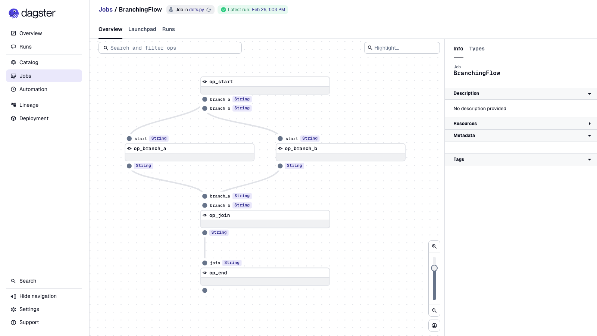
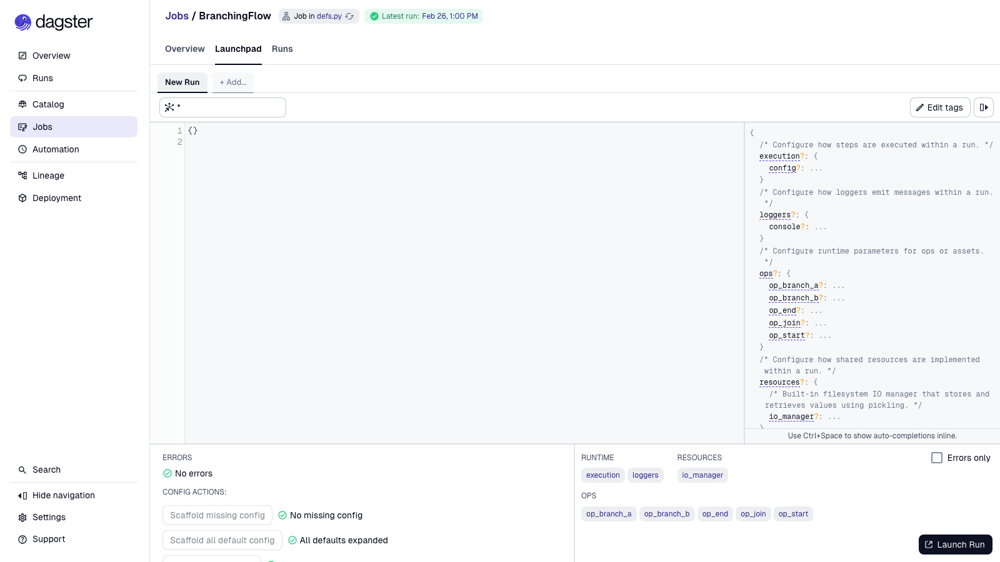
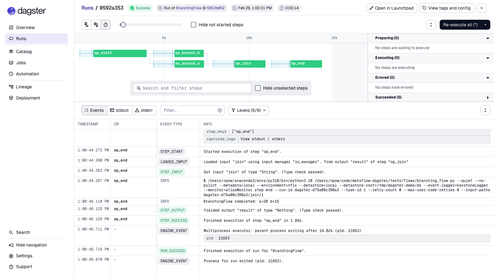
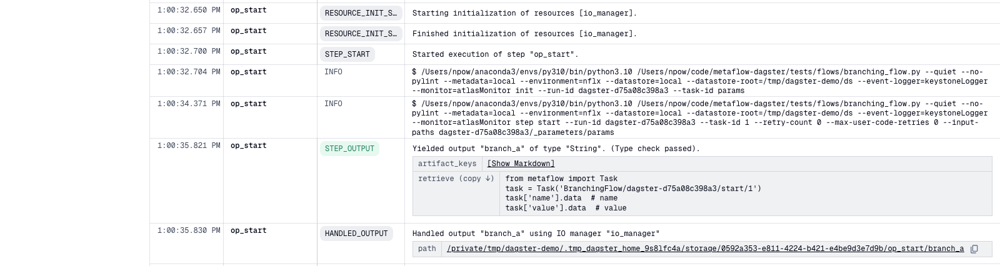
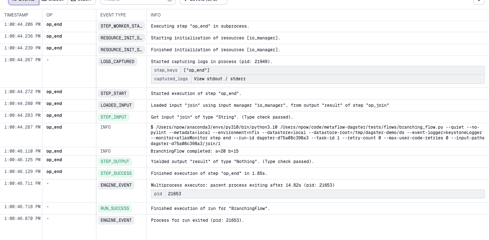

# metaflow-dagster

[](https://github.com/npow/metaflow-dagster/actions/workflows/ci.yml)
[](https://pypi.org/project/metaflow-dagster/)
[](LICENSE)
[](https://www.python.org/downloads/)

Deploy and run Metaflow flows as Dagster jobs.

`metaflow-dagster` generates a self-contained Dagster definitions file from any Metaflow flow, letting
you schedule, monitor, and launch your pipelines through Dagster while keeping all your existing
Metaflow code unchanged.

## Install

```bash
pip install metaflow-dagster
```

Or from source:

```bash
git clone https://github.com/npow/metaflow-dagster.git
cd metaflow-dagster
pip install -e ".[test]"
```

## Quick start

```bash
python my_flow.py dagster create dagster_defs.py
dagster dev -f dagster_defs.py
```

## Usage

### Generate and run a Dagster job

```bash
python my_flow.py dagster create dagster_defs.py
dagster dev -f dagster_defs.py
```

Or execute directly in Python:

```python
from dagster_defs import MyFlow
result = MyFlow.execute_in_process()
```

### All graph shapes are supported

```python
# Linear
class SimpleFlow(FlowSpec):
    @step
    def start(self):
        self.value = 42
        self.next(self.end)
    @step
    def end(self): pass

# Split/join (branch)
class BranchFlow(FlowSpec):
    @step
    def start(self):
        self.next(self.branch_a, self.branch_b)
    ...

# Foreach fan-out
class ForeachFlow(FlowSpec):
    @step
    def start(self):
        self.items = [1, 2, 3]
        self.next(self.process, foreach="items")
    ...
```

### Parametrised flows

Parameters defined with `metaflow.Parameter` are forwarded automatically as a typed Dagster `Config`
class on the start op:

```bash
python param_flow.py dagster create param_flow_dagster.py
```

Then pass them via Dagster's run config:

```python
result = ParametrizedFlow.execute_in_process(run_config={
    "ops": {"op_start": {"config": {"greeting": "Hi", "count": 5}}}
})
```

### Step decorators (`--with`)

Inject Metaflow step decorators at deploy time without modifying the flow source:

```bash
# Run every step in a sandbox (e.g. metaflow-sandbox extension)
python my_flow.py dagster create my_flow_dagster.py --with=sandbox

# Multiple decorators are supported
python my_flow.py dagster create my_flow_dagster.py \
  --with=sandbox \
  --with='resources:cpu=4,memory=8000'
```

### Retries and timeouts

`@retry` and `@timeout` on any step are picked up automatically. The generated op gets a Dagster
`RetryPolicy` and an `op_execution_timeout` tag — no extra configuration needed:

```python
class MyFlow(FlowSpec):
    @retry(times=3, minutes_between_retries=2)
    @timeout(seconds=300)
    @step
    def train(self):
        ...
```

Generates:
```python
@op(retry_policy=RetryPolicy(max_retries=3, delay=120),
    tags={"dagster/op_execution_timeout": "300"})
def op_train(context): ...
```

Each Dagster retry passes the correct `--retry-count` to Metaflow so attempt numbering is consistent.

### Environment variables

`@environment(vars={...})` on a step passes those variables to the `metaflow step` subprocess:

```python
@environment(vars={"TOKENIZERS_PARALLELISM": "false"})
@step
def embed(self): ...
```

### Project namespace

If the flow uses `@project(name=...)`, the Dagster job name is automatically prefixed:

```python
@project(name="recommendations")
class TrainFlow(FlowSpec): ...
```

```bash
python train_flow.py dagster create out.py
# job name: recommendations_TrainFlow
```

### Workflow timeout

Cap the total wall-clock time for the entire job run:

```bash
python my_flow.py dagster create my_flow_dagster.py --workflow-timeout 3600
```

### Attach tags

Metaflow tags are forwarded to every `metaflow step` subprocess at compile time:

```bash
python my_flow.py dagster create my_flow_dagster.py --tag env:prod --tag version:2
```

### Custom job name

```bash
python my_flow.py dagster create my_flow_dagster.py --name nightly_pipeline
```

## Configuration

### Metadata service and datastore

By default, `metaflow-dagster` uses whatever metadata and datastore backends are active in your
Metaflow environment. The generated file bakes in those settings at creation time so every step
subprocess uses the same backend.

To use a remote metadata service or object store, configure them before running `dagster create`:

```bash
python my_flow.py \
  --metadata=service \
  --datastore=s3 \
  dagster create my_flow_dagster.py
```

Or via environment variables:

```bash
export METAFLOW_DEFAULT_METADATA=service
export METAFLOW_DEFAULT_DATASTORE=s3
python my_flow.py dagster create my_flow_dagster.py
```

### Scheduling

If your flow has a `@schedule` decorator, the generated file includes a `ScheduleDefinition`
automatically. No extra configuration needed.

## How it works

`metaflow-dagster` compiles your Metaflow flow's DAG into a self-contained Dagster definitions file.
Each Metaflow step becomes a `@op`. The generated file:

- runs each step as a subprocess via the standard `metaflow step` CLI
- passes `--input-paths` correctly for joins and foreach splits
- emits Metaflow artifact keys and a retrieval snippet to the Dagster UI after each step

### Job graph

The compiled DAG is fully visible in Dagster — typed inputs, fan-out branches, and fan-in joins:



### Launchpad

Parametrised flows get a typed config schema in the Dagster launchpad, populated from your
Metaflow `Parameter` defaults:



### Run timeline

Each Metaflow step appears as a Dagster op with real wall-clock timing. Parallel branches run
concurrently:



### Artifact retrieval

After each step, the op emits the artifact keys and a ready-to-copy retrieval snippet — without
loading the values themselves:



```python
from metaflow import Task
task = Task('BranchingFlow/dagster-d75a08c398a3/start/1')
task['value'].data
```

### Step logs

Every op logs the exact `metaflow step` CLI command it ran. Flow `print()` output streams through
Dagster's log panel:



## Development

```bash
git clone https://github.com/npow/metaflow-dagster.git
cd metaflow-dagster
pip install -e ".[test]"
pytest -v
```

The test suite runs real end-to-end: compile → load module → `execute_in_process` → verify
Metaflow artifacts on disk. No mocks.

## License

[Apache 2.0](LICENSE)
